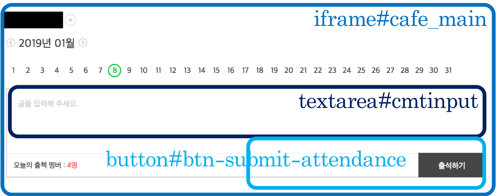

# 네이버 카페 자동 출석체크
스크립트를 실행하고 브라우저 창이 열리면 미리 로그인하고 콘솔에서 엔터를 누르고 지정된 시간까지 대기한다.

## ⚙️ settings ⚙️

```json
// secret.json
{
    "url": "https://cafe.naver.com/???",
    "element": "a#menuLink46"
}
```

- `url`: naver cafe address
- `element`: attendance board element in naver cafe

## 🔥 mechanism 🔥



1. Switch to `iframe#cafe_main`
2. Input message in `textarea#cmtinput`
3. Click `button#btn-submit-attendance`
